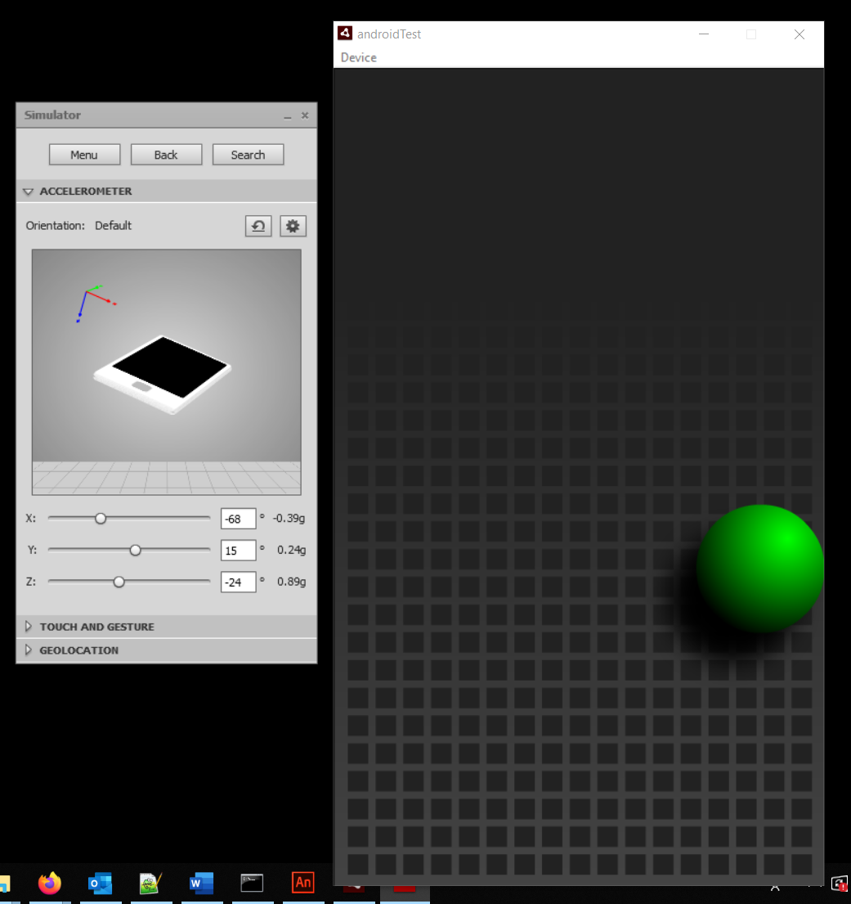

# Miscellaneous Flash Projects

These are some Flash apps for own reference. These are not full-fledged applications. Just got my hands on some of the in-built capabilities of Flash. All of them were created in 2012. Details below - 

1. **SpeedometerAndroidApp:** An Android app that shows the *Speed* using the phone accelerometer. Runs on top of Adobe AIR SDK. Gets geolocation in every second and shows the updated speed as text.

   **Important files:**
   * **Speedometer.fla:** The main flash project.
   * **Speedometer.as`:** The back-end logic.

2. **AccelerometerTest_AndroidApp:** A sample Android app that controls the ball movement through the accelerometer. Runs on top of Adobe AIR SDK. The controller code is written within the .fla file as *action*. Made from a sample project. So, not entirely my work. A screenshot is attached at the end from the simulation.

3. **BlankTraceApp:** Basically a *"Hello, World!"* program showing interaction with a separate *ActionScript* class. When runs, it shows *hello world* in the console output.

**Screenshot of AccelerometerTest AndroidApp**

